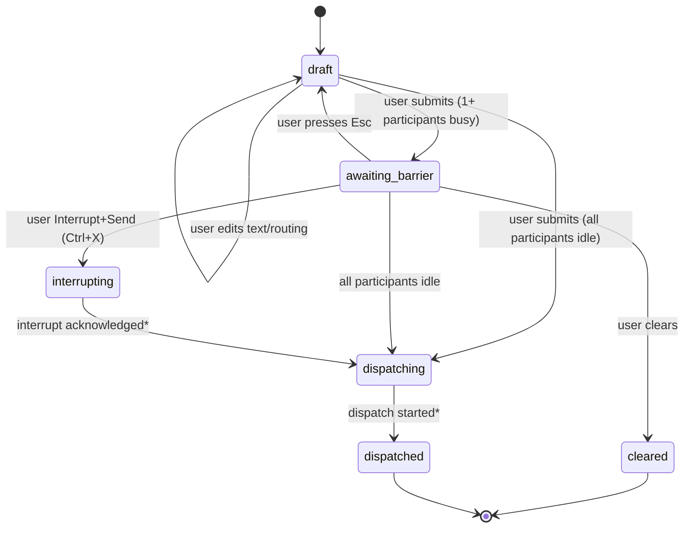

# UI design (open): barrier-batch staging model for multi-participant messaging

Status: open / experimental

This document proposes an alternative to "send-now vs queued" semantics: a
barrier-batch staging model. It is intentionally exploratory. We expect to
prototype and learn before committing to a long-term interaction model.

## Motivation

With multiple participants, mixing real-time delivery (idle participants get messages
immediately) and turn-based delivery (busy participants receive messages later) can
become confusing quickly:

- Did participant A already receive the message while participant B is still working?
- If the user sends multiple follow-ups, did idle participants receive earlier
  versions while busy participants will receive the concatenation?
- How do we reason about coordination when participants are at different "steps"?

Barrier-batch reframes the UX as: "prepare the next turn for a set of participants,
then dispatch it when they are all ready."

## Core idea

Instead of enqueuing messages per participant, the UI maintains a *staged batch* that
represents the next instruction payload for the room.

Dispatch is barrier-based:

- A batch is delivered only when **all** participants in the batch's barrier set are
  idle (ready to accept a new turn), or the user explicitly interrupts them.

This removes "partial delivery" as a default behavior: a batch either has not
been delivered, or it has been delivered to the whole target set.

The barrier gates on **all** participants that are available at the time the batch
is staged, including those receiving a message for awareness only (e.g. via `@alias`
routing). This sequences all interactions and prevents any participant from
receiving the next message while another is still working on the current one. The
result is a consistent shared-history invariant: all participants see the same
sequence of messages in the same order.

### Targets and routing

In the default case, a user-authored message is dispatched to all participants in
the room.

If the message begins with `@alias`, it is still dispatched to all participants,
but it carries an explicit routing intent:

- the addressed participant is the actor (expected to take action)
- other participants are notified for awareness

Barrier-batch treats both actor and notified participants as part of the same
barrier: dispatch waits until *everyone* in the batch is idle (or is explicitly
interrupted).

## Scope decision

- This model applies to user-authored messages only.
- Participant-to-participant messaging is out of scope.

## UX overview

This section defines the proposed UI for the barrier-batch model.

### Staged composer

When the user submits a message while one or more participants are busy, the
composer **transitions to staged mode**:

- the submitted text is rendered greyed-out (read-only)
- keystrokes do not edit the buffer while staged
- an explicit status line appears, e.g.:

  `Message on-hold. Participants busy: ada, turing. Press Esc to edit. Press Ctrl+X to interrupt and send.`

  Aliases are colored per their assigned participant color.

The staged composer replaces the normal composer in the layout — there is no
separate queue pane above it. The composer surface itself is the staging area.

The staged composer returns to normal editing mode when:

- `Esc` is pressed (user wants to edit before sending), or
- `Ctrl+X` is pressed (Interrupt + Send), or
- all participants in the batch's barrier set become idle (automatic dispatch);
  the composer is cleared and ready for new input.

If all participants are already idle when the user hits Enter, dispatch happens
immediately and the composer never enters staged mode — it clears as normal.

### History browsing while staged

While the composer is in staged mode, the user retains full access to history:

- `Ctrl+O` switches focus to the history viewport.
- All history-mode commands (`Ctrl+G`, etc.) remain available.
- The staged status line remains visible regardless of focus.

### Send modes

This model intentionally supports two explicit routing intents while keeping the
same barrier rule (always gate on everyone in the batch's barrier set):

1. **Send all**: no explicit `@alias` prefix; all participants are actors by
   default.
2. **Send one**: message begins with `@alias`; the addressed participant is the
   actor and the rest are notified for awareness.

## Definitions

### "Idle" signal

Barrier-batch requires an explicit "participant is idle" signal from the session /
participant adapter, not a heuristic derived from output streams.

Conceptually:

- idle: the participant has no active turn in progress
- busy: the participant currently has an active turn

The concrete event(s) that transition a participant between these states must be
identified before implementation (e.g. turn started / turn completed /
turn cancelled / participant removed).

## State machine (staged batch)

This section defines the minimal states for a staged batch and what triggers
transitions.

### Barrier set and availability snapshot

When a batch is staged, the UI snapshots the set of participants that are
*available* at that moment. This snapshot is the batch's barrier set and dispatch
set.

- Newly invited participants are not retroactively added to an existing staged
  batch.
- Participants that crash or are removed after staging are marked `discarded` and
  excluded from both the barrier and the eventual dispatch.

### Batch states

```
draft ──(user edits text/routing)──────────────> draft
draft ──(user submits; all participants idle)──> dispatching
draft ──(user submits; 1+ participants busy)───> awaiting_barrier
awaiting_barrier ──(all participants idle)────> dispatching
awaiting_barrier ──(user presses Esc)─────────> draft
awaiting_barrier ──(user Interrupt+Send)──────> interrupting
interrupting ──(interrupt acknowledged*)──────> dispatching
dispatching ──(dispatch started*)──────────────> dispatched
draft/awaiting_barrier ──(user clears)────────> cleared
```

`*` The "acknowledged/accepted" signals must come from explicit adapter/session
events. Avoid inferring them from stdout/stderr output.

`dispatch started` means the UI has issued dispatch requests and committed the
user-authored message to the transcript/history. There is no notion of "receipt
acknowledgement" from participants.

### Batch state diagram



### Target readiness (per participant)

For the purpose of rendering the barrier:

```
ready = idle
blocked = busy
discarded = removed/crashed
```

If a participant crashes or is removed while a batch is awaiting the barrier, that
participant becomes `discarded`. Dispatch proceeds automatically to the remaining
participants once they are ready (best-effort barrier).

## Behavioral rules

### Text composition

In staged mode there is exactly one staged batch at a time:

- Pressing `Enter` either dispatches immediately (all participants in the batch's
  barrier set are idle) or stages the batch (one or more participants are busy).
- While staged, the user cannot submit additional messages. To change or extend
  the staged payload, the user presses `Esc` to return to draft and modifies the
  text before resubmitting.

This keeps "what will be sent next" unambiguous.

### Target set semantics

The set of participants a staged batch considers (barrier + dispatch) is fixed at
the time of staging. The model does not retroactively add newly invited
participants to an existing staged batch.

### Interrupt behavior

Interrupt is always explicit.

- `Ctrl+X` (`Interrupt + Send`) requests cancellation of in-flight turns for the
  batch's blocked participants, then proceeds to dispatch the batch to all
  non-discarded participants in the batch snapshot.

**Interrupt acknowledgement signal (implementation note):**
The Codex adapter sends `turn/interrupt` to the process. The process eventually
responds with `turn/completed` (or `turn/failed`), which the client surfaces as a
`ModeFlush` message through `Read()`. There is no separate "interrupt acknowledged"
event distinct from normal turn completion — both paths produce the same `ModeFlush`.

At the session layer, no `KindTurnCompleted` event currently exists. To implement
the `interrupting → dispatching` transition cleanly (without inferring idle state
from `ModeFlush` in the UI layer), the session layer needs a new event kind
(e.g. `KindAgentIdle` or `KindTurnCompleted`) that fires whenever a participant's
turn ends, regardless of cause.

Decision: dispatch should wait for the `ModeFlush` signal (turn end) before
proceeding, to avoid interleaving two turns. Adding a dedicated session event is a
prerequisite for clean implementation.

## Transcript interaction

Input only appears in the history when the staged text is dispatched.

Rationale: the staged composer is the canonical place to view and edit "next
turn" content; the transcript records only committed/dispatched communication.

"Dispatched" means "dispatch attempt started" — participants do not confirm receipt.
The staged text is committed to the transcript/history at dispatch start. Avoid
adding additional history records for per-target delivery churn.

Emit a system record only for disruptive actions (e.g. `[→ ada] interrupt
requested`).

## Edge cases

### Crash during dispatching (partial dispatch)

The state machine covers participants being removed/crashed while a batch is
awaiting the barrier. A separate edge case exists when a participant crashes
mid-dispatch (after the batch has been dispatched to some participants but not all).

This is not fatal to the barrier-batch model. The "barrier" guarantee ends at the
start of dispatching: once a dispatch attempt begins, delivery is best-effort and
may partially succeed.

Recovery is user-driven using normal primitives (e.g. re-send a new batch to the
missing participants, or Interrupt + Send to re-synchronize).

## Why we're trying this first

Barrier-batch is intentionally conservative:

- It makes multi-participant coordination easier to reason about.
- It creates a natural "sync point" for roles like reviewer/tester that should
  respond to the same instruction payload.
- It provides a clear baseline to evaluate later against more parallel,
  throughput-oriented models (e.g. async dispatch with snapshots).

## Open questions / experiments

- Does barrier-batch feel too "slow" due to gating on the slowest participant?
- Should "Send all" default to a subset (e.g. only reviewers) to avoid
  unnecessary barriers?
- What is the best UI affordance for changing routing intent mid-draft?
- How do we represent partial failure (one participant removed) without reintroducing
  confusing semantics?
- What is the minimal set of lifecycle events we need to drive `idle/busy`
  reliably across backends other than Codex (Claude Code, Aider)?
