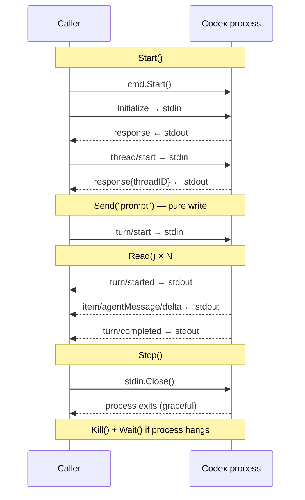

# Package design: internal/agent and internal/agent/codex

This document covers two packages designed together:

- **`internal/agent`** — the `Agent` interface, shared types (`Event`), and the `SendAndWait` free function.
- **`internal/agent/codex`** — the Codex implementation of `Agent`: a thin process wrapper around the Codex app-server.

---

## internal/agent

### Agent interface

```go
type Event struct {
    Delta string // text fragment; empty on non-delta events
    Done  bool   // true on the final event of a turn
}

type Agent interface {
    Start() error
    Send(prompt string) error
    Read() (Event, error)
    Stop() error
}
```

Errors — both IO errors and turn failures — are returned as the `error` return value of `Read()`. There is one place to check for errors.

### SendAndWait

`SendAndWait` is a free function that works for any `Agent` implementation:

```go
func SendAndWait(a Agent, prompt string) (string, error)
```

It calls `Send` then loops `Read` until `Event.Done` is true, accumulating `Event.Delta` values. Because `Read()` returns a semantic type, `SendAndWait` requires no backend knowledge.

`Send` + `Read` are the low-level primitives for callers that need to process output as it streams.

---

## internal/agent/codex

### What this package is

A thin process wrapper around the Codex app-server. It starts the process, speaks JSON-RPC 2.0 over stdio, and implements the `Agent` interface.

It is **not** responsible for sequencing turns across multiple agents, routing messages, or any session-level logic. That belongs in the session and router layers.

### API model

The API follows the same model as the `http` package: calls are blocking. If the caller needs concurrency, it adds a goroutine at the call site. The package introduces no goroutines during steady-state operation. The one exception is `Stop()`, which spawns a short-lived goroutine to race the graceful exit against a timeout.

| Method | Behaviour |
|---|---|
| `Start()` | Launches the process; blocks until initialize + thread/start handshakes complete |
| `Send(prompt)` | Writes the turn/start request to stdin and returns immediately — no stdout read |
| `Read()` | Blocks until a meaningful event is ready; translates Codex notifications into `agent.Event` |
| `Stop()` | Closes stdin and waits for the process to exit; kills if it hangs |

`Send` is a pure write. It does not read stdout.

`Read()` blocks until it can return a meaningful event. Unknown or unrecognised notifications are discarded; the observer records them.

The Codex-specific mapping is:

| Codex notification | Event |
|---|---|
| `item/agentMessage/delta` | `{Delta: "..."}` |
| `turn/completed` | `{Done: true}` |
| `turn/failed` | error returned from `Read()` |

### Protocol observer

```go
type ProtocolObserver interface {
    OnSend(msg string)
    OnReceive(msg string)
}
```

An optional observer receives every raw JSON line before any processing. A file-based implementation provides a wire log for debugging; a slice-based implementation captures messages for test assertions.

`msg` is the raw JSON without the trailing newline. Implementations must be fast; avoid operations that can block for non-trivial time (network calls, contested locks). A log file write is acceptable.

Hook points:
- **Send path**: after serialising the request, before writing to stdin — `observer.OnSend(raw)`
- **Read path**: after reading a raw line from stdout, before parsing — `observer.OnReceive(raw)`

The observer sees the truth: whatever actually flows over stdio, regardless of whether our parsing is correct. This makes it the right tool for validating protocol assumptions (such as "errors arrive as turn/failed notifications, not as RPC error responses") without encoding that validation into production logic.

### Sequential request constraint

The Codex app-server processes one turn at a time. The call sequence is always:

```
initialize → thread/start → turn/start → turn/start → …
```

`Start()` consumes the responses from initialize and thread/start. After that, `Read()` is expected to see only notification lines (method-bearing, no id). This is an observed invariant monitored by the protocol observer, not a guarantee the package enforces. If `Read()` encounters a response line it skips it deliberately — response lines after `Start()` are unexpected and the observer log is the right place to investigate them.

### Normal flow



### Thread-safety contract

Only one goroutine may call `Read()` at a time. `Stop()` may be called from a different goroutine to interrupt a blocked `Read()` — that is the one permitted concurrent pair. No other concurrent combinations are allowed.

### Shutdown

`Stop()` closes stdin, which signals EOF to the Codex process and is the expected graceful exit path. If the process does not exit within `stopGracePeriod` (5 s), it is killed. In either case `Wait()` is called before `Stop()` returns.

If `Read()` is blocked on another goroutine, the process death closes stdout and unblocks `Read()` with an error. Callers should treat a `Read()` error following `Stop()` as clean EOF, not a failure.

### Design boundary

The session and router layers own:

- Deciding when to call `Send` or `SendAndWait`
- Spawning goroutines to read streaming output concurrently with other events
- Sequencing turns across multiple agents
- Restarting a crashed agent

This package owns:

- Process lifecycle (start, kill, reap)
- JSON-RPC framing over stdio
- Translating Codex notifications into `agent.Event`
- Wire-level observability (`ProtocolObserver`)
