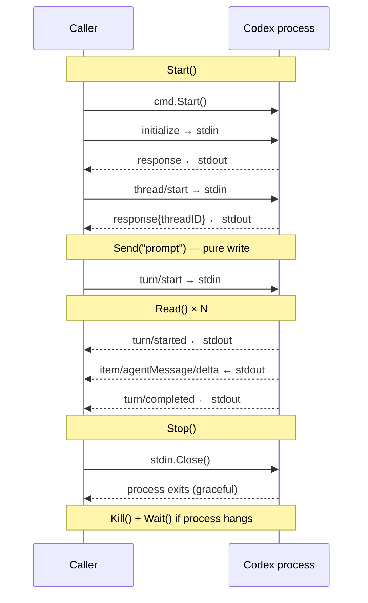

# Package design: internal/agent and internal/agent/codex

This document covers two packages designed together:

- **`internal/agent`** — the `Agent` interface, shared types (`Message`), and the `SendAndWait` free function.
- **`internal/agent/codex`** — the Codex implementation of `Agent`: a thin process wrapper around the Codex app-server.

---

## internal/agent

### Agent interface

```go
type Agent interface {
    Start() error
    Send(prompt string) (StreamID, error)
    SendNotice(prompt string) (StreamID, error)
    Read() (Message, error)
    Interrupt() error
    Stop() error
}
```

Errors — both IO errors and turn failures — are returned as the `error` return value of `Read()`. There is one place to check for errors.

`Message` and all content types (`Output`, `Reasoning`, `Command`, `FileChangeSet`, `Log`, etc.) are defined in `internal/agent`. See [`pkg-agent-messages.md`](pkg-agent-messages.md) for the full message model, streaming lifecycle, and accumulation semantics.

### SendAndWait

`SendAndWait` is a free function that works for any `Agent` implementation:

```go
func SendAndWait(a Agent, prompt string) (string, error)
```

It calls `Send` then accumulates `Output` stream messages until the turn-level `ModeFlush`, returning the full text response. `Log` messages are discarded. `SendAndWait` is a convenience for callers that only need the final text response and do not need to observe intermediate tool activity.

`Send` + `Read` are the low-level primitives for callers that need to process output as it streams, including `MessageLog` messages.

`Send` and `SendNotice` both return the turn anchor `StreamID`. Callers that
need full lifecycle control track that anchor and treat its flush as the
authoritative turn-end signal. Convenience helpers such as `SendAndWait` may
ignore the returned anchor when they consume the full turn inline.

---

## internal/agent/codex

### What this package is

A thin process wrapper around the Codex app-server. It starts the process, speaks JSON-RPC 2.0 over stdio, and implements the `Agent` interface.

It is **not** responsible for sequencing turns across multiple agents, routing messages, or any session-level logic. That belongs in the session and router layers.

### API model

The API follows the same model as the `http` package: calls are blocking. If the caller needs concurrency, it adds a goroutine at the call site. The package owns two persistent goroutines after `Start()` returns: a stderr reader that captures diagnostic lines and queues them for `Read()`, and a short-lived one in `Stop()` that races graceful exit against a timeout. No other goroutines are introduced during steady-state operation.

| Method | Behaviour |
|---|---|
| `Start()` | Launches the process; blocks until initialize + thread/start handshakes complete |
| `Send(prompt)` | Writes the turn/start request to stdin and returns immediately — no stdout read |
| `Read()` | Blocks until a meaningful message is ready; translates Codex notifications into `agent.Message` |
| `Stop()` | Closes stdin and waits for the process to exit; kills if it hangs |

`Send` is a pure write. It does not read stdout.

`Read()` blocks until it can return a meaningful message — either a stdout-derived notification (`delta`, `done`) or a queued stderr line (`log`). Unknown or unrecognised notifications are discarded; the observer records them.

Visible output is item-scoped, not turn-scoped: each `item/agentMessage/delta`
opens or extends a transcript stream keyed by `turnId + itemId`. When
`turn/completed` arrives, the adapter inspects `turn.items[]` and emits one
`Output + ModeFlush` per completed `agentMessage` item, using that same stream
ID.

The Codex-specific mapping is:

| Source | Message(s) |
|---|---|
| `item/agentMessage/delta` | `{ID: "codex:output:<turnId>:<itemId>", Mode: ModeStream, Content: Output{Text: "..."}}` |
| `item/reasoning/delta` | `{ID: "codex:reasoning:<itemId>", Mode: ModeStream, Content: Reasoning{Text: "..."}}` |
| `item/commandExecution/outputDelta` | `{ID: "codex:command:<itemId>", Mode: ModeStream, Content: Command{Output: "..."}}` |
| `item/completed` (commandExecution) | `{..., Mode: ModeStream, Content: Command{ExitCode: &n}}` then `{..., Mode: ModeFlush, Content: Empty{}}` |
| `item/completed` (fileChange) | `{ID: "codex:filechange:<itemId>", Mode: ModeStream, Content: FileChangeSet{...}}` then ModeFlush |
| `turn/completed` | for each completed `agentMessage` item: `{ID: "codex:output:<turnId>:<itemId>", Mode: ModeFlush, Content: Output{}}` |
| `turn/failed` | error returned from `Read()` |
| stderr line | `{ID: "codex:log:<…>", Mode: ModeSingle, Content: Log{Text: "..."}}` |

Stderr is captured via a dedicated pipe and read by a background goroutine started in `Start()`. Lines are queued internally and surfaced through `Read()` alongside stdout-derived messages. This keeps the `Read()` interface as the single point of consumption for all agent output.

### SendNotice semantics

`SendNotice` starts a normal turn (`turn/start`) but provides an output schema that
encourages a minimal JSON acknowledgement (e.g. `{"acknowledge":true}`) and suppresses
that acknowledgement from `Read()`.

Even when the notice is fully acknowledged (or produces no deltas), the adapter
still emits a synthetic `Output + ModeFlush` on `codex:notice-turn` derived from
`turn/completed` (or `turn/failed`). This lets downstream consumers treat a
silent notice as a complete lifecycle without overloading normal output streams.

### Turn anchors

`Send` and `SendNotice` return a turn anchor to the caller.

The anchor is the agent-level contract that defines turn lifetime. It is not
"the last currently visible output stream"; it is the explicit stream whose
flush means "this turn is now over".

Why this exists:

- Codex can emit multiple auxiliary streams during one turn (`Output`,
  `Reasoning`, `Command`, `FileChangeSet`).
- Those streams may open and close in phases.
- If a caller inferred turn completion from "all currently observed streams are
  closed", it could end the turn too early and misclassify later valid output as
  stray protocol noise.

The adapter therefore gives callers a stable anchor immediately on `Send*`:

- for normal visible turns, the anchor represents the turn lifecycle even though
  visible output remains item-scoped
- for notice turns, the adapter emits a dedicated synthetic flush on
  `codex:notice-turn`

Consumer rule:

- treat the returned anchor as authoritative turn-end
- do not infer turn completion from auxiliary stream closure alone

This is the bridge between agent protocol semantics and participant/session
lifecycle semantics.

### Protocol observer

```go
type ProtocolObserver interface {
    OnSend(msg string)
    OnReceive(msg string)
}
```

An optional observer receives every raw JSON line before any processing. A file-based implementation provides a wire log for debugging; a slice-based implementation captures messages for test assertions.

`msg` is the raw JSON without the trailing newline. Implementations must be fast; avoid operations that can block for non-trivial time (network calls, contested locks). A log file write is acceptable.

Hook points:
- **Send path**: after serialising the request, before writing to stdin — `observer.OnSend(raw)`
- **Read path**: after reading a raw line from stdout, before parsing — `observer.OnReceive(raw)`

The observer sees the truth: whatever actually flows over stdio, regardless of whether our parsing is correct. This makes it the right tool for validating protocol assumptions (such as "errors arrive as turn/failed notifications, not as RPC error responses") without encoding that validation into production logic.

### Sequential request constraint

The Codex app-server processes one turn at a time. The call sequence is always:

```
initialize → thread/start → turn/start → turn/start → …
```

`Start()` consumes the responses from initialize and thread/start. After that, `Read()` is expected to see only notification lines (method-bearing, no id). This is an observed invariant monitored by the protocol observer, not a guarantee the package enforces. If `Read()` encounters a response line it skips it deliberately — response lines after `Start()` are unexpected and the observer log is the right place to investigate them.

### Normal flow



### Thread-safety contract

Only one goroutine may call `Read()` at a time. `Stop()` may be called from a different goroutine to interrupt a blocked `Read()` — that is the one permitted concurrent pair. No other concurrent combinations are allowed.

### Shutdown

`Stop()` closes stdin, which signals EOF to the Codex process and is the expected graceful exit path. If the process does not exit within `stopGracePeriod` (5 s), it is killed. In either case `Wait()` is called before `Stop()` returns.

If `Read()` is blocked on another goroutine, the process death closes stdout and unblocks `Read()` with an error. Callers should treat a `Read()` error following `Stop()` as clean EOF, not a failure.

### Design boundary

The session and router layers own:

- Deciding when to call `Send` or `SendAndWait`
- Spawning goroutines to read streaming output concurrently with other events
- Sequencing turns across multiple agents
- Restarting a crashed agent

This package owns:

- Process lifecycle (start, kill, reap)
- JSON-RPC framing over stdio
- Translating Codex notifications into `agent.Message`
- Wire-level observability (`ProtocolObserver`)
