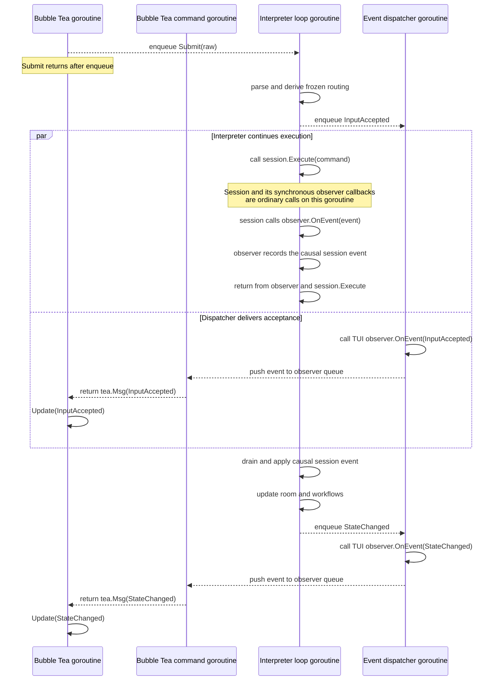
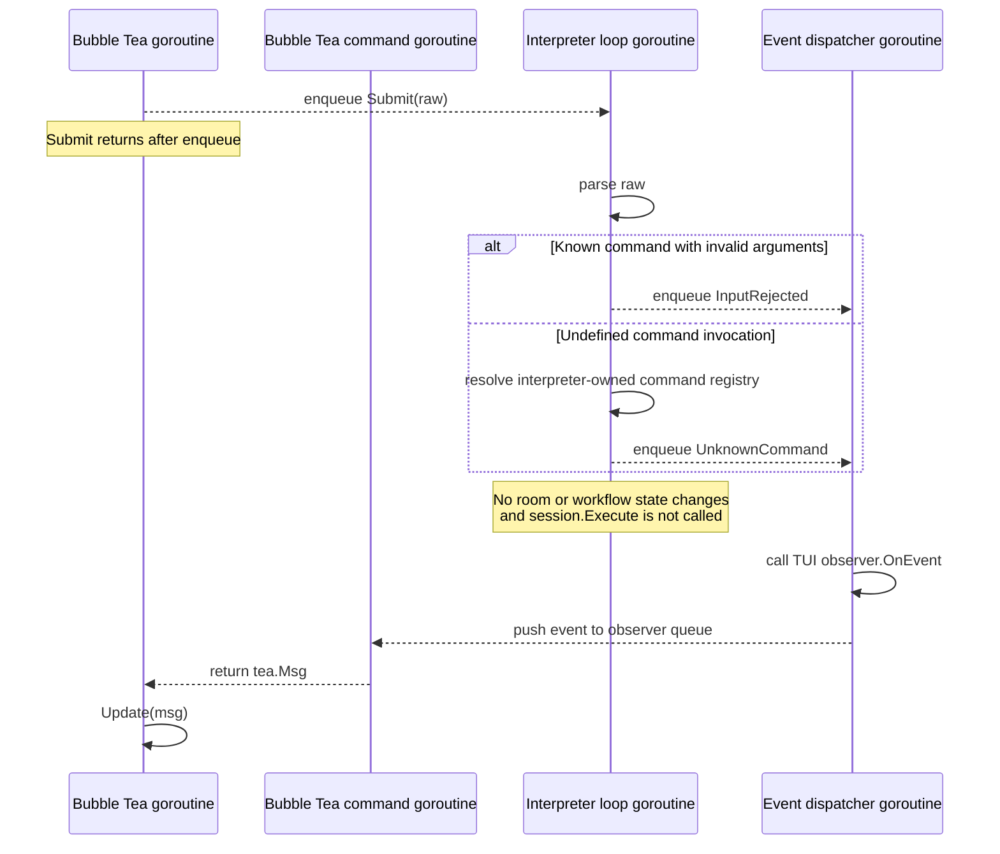
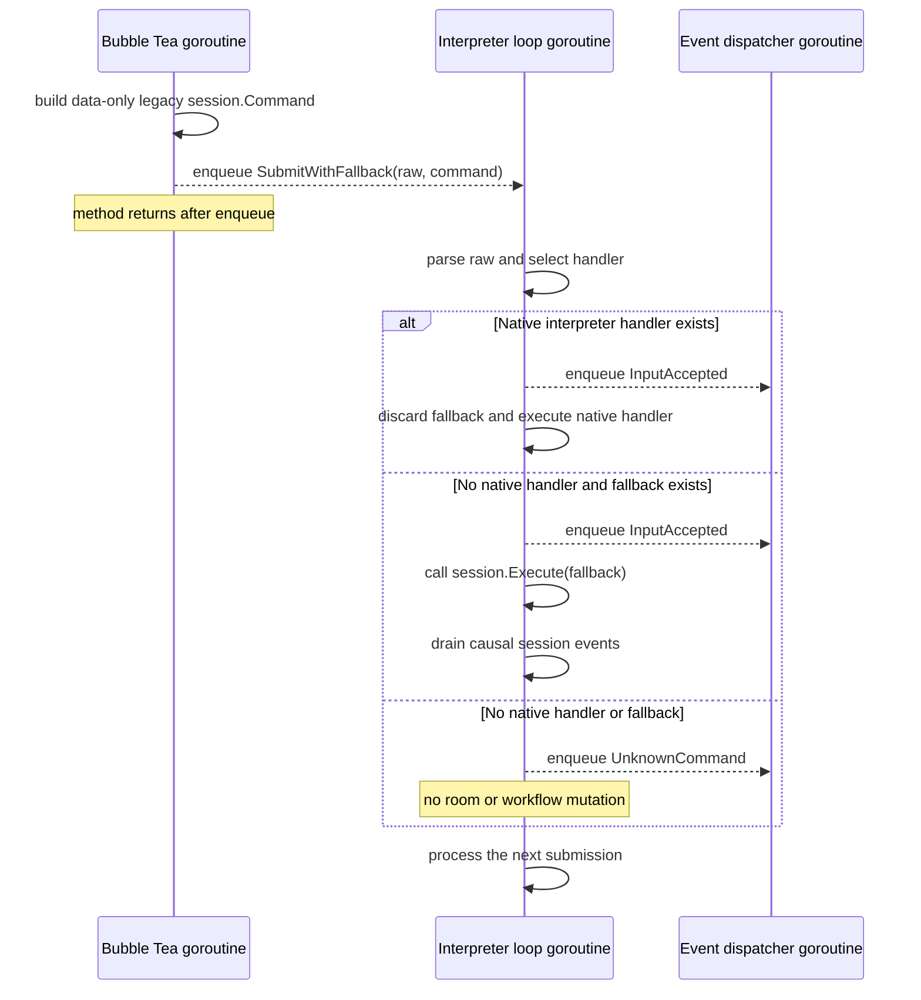

# Package design: internal/interpreter

## Scope

The interpreter is coderoom's UI-independent application layer. It accepts
prompt-language input, coordinates its execution, and exposes observable state
and events to front ends.

The dependency direction is:

```text
internal/ui -> internal/interpreter -> internal/session
                                  \-> internal/room
                                  \-> internal/participant
                                  \-> internal/promptlang
                                  \-> internal/shell
```

`internal/interpreter` must not import `internal/ui` or Bubble Tea. The TUI
must not call or observe `internal/session` directly. A future non-interactive
runner should be able to use the same interpreter without reproducing TUI
behavior.

The interpreter owns:

- parsing submitted text into `promptlang.Statement` values
- the room-scoped command-definition registry
- translation of statements into session commands
- shell-definition invocation and shell-process lifetime
- bounded-loop state and coordination
- barrier-batch state, readiness transitions, and interrupt-and-dispatch
- the canonical `room.Room` projection used during execution
- serialized calls to `session.Execute`
- application-level events and snapshots consumed by front ends

It does not own:

- participant or agent runtime invariants
- participant color allocation
- agent process I/O
- session routing and policy enforcement
- prompt-language grammar
- terminal presentation, focus, key bindings, or styling

## Construction and public boundary

The interpreter is the application facade presented to the UI:

```go
type Interpreter struct {
    // session, room, registry, execution loop, and observers are private
}

func New(ctx context.Context, sess SessionController, cwd string, opts ...Option) *Interpreter
func (i *Interpreter) Submit(raw string)
func (i *Interpreter) SubmitWithFallback(raw string, fallback session.Command)
func (i *Interpreter) ResolveApproval(id int64, choice ApprovalChoice)
func (i *Interpreter) TakeStageForEdit() (string, bool)
func (i *Interpreter) DiscardStage() bool
func (i *Interpreter) InterruptAndDispatchStage() bool
func (i *Interpreter) Snapshot() Snapshot
func (i *Interpreter) AddObserver(Observer)
func (i *Interpreter) Close()
```

`Submit` is the only prompt-language entry point. User-authored `/cancel`,
`/invite`, `/remove`, sends, and every other language statement all use this
path. The facade must not add methods such as `Cancel(alias)` that duplicate a
statement and create a second execution path.

`SubmitWithFallback` is a temporary migration API. The TUI may provide a
data-only `session.Command` produced by its legacy translation path. The
interpreter parses the raw input and, when it has no native handler, executes
that fallback command on the interpreter-loop goroutine. A native handler
always takes precedence and the unused fallback is discarded. If neither a
native handler nor fallback exists, the interpreter emits `UnknownCommand`.
After the active-stage gate described below, parsing and argument validation
happen before handler selection; `InputRejected` discards the fallback without
executing it.
The method is removed with the last legacy command translator and is not part
of the intended final facade.

Fallback construction must not query mutable session or room state outside the
interpreter loop. Workflows that require such planning, including barrier
staging and handoff source selection, migrate as a unit rather than encoding a
stale precomputed fallback. The temporary UI dependency on `internal/session`
is limited to constructing fallback command values; it never calls
`session.Execute`.

Dedicated methods are reserved for structured interactions that are not prompt
language: resolving an approval; editing, discarding, or interrupting and
dispatching a staged submission; reading a snapshot; and shutdown. The boundary
invariant is that front ends express intent to the interpreter and do not
receive the underlying `*session.Session`.

`Snapshot` contains the application state needed for presentation, including
the canonical room snapshot and participant roster. It contains values, not
live session or room objects. The roster uses `participant.View`, the safe
observable portion embedded in the live `participant.Participant`. This keeps
participant fields and domain types canonical while preventing front ends from
receiving agent capabilities or runtime bookkeeping.

### Session dependency

The interpreter accepts the narrow session behavior it consumes rather than a
concrete `*session.Session`. The interface is declared by the interpreter:

```go
type SessionController interface {
    Execute(session.Command) error
    AddObserver(session.Observer)
    PlanSharedSend(alias string) session.SharedSendPlan
    Roster() []participant.View
    Participant(alias string) (participant.Participant, bool)
    RoutableParticipants() []participant.Participant
    BarrierParticipants() []participant.Participant
    Shutdown()
}
```

This is the initial interface based on existing behavior. `SessionController`
is the interpreter's internal dependency port, not the facade presented to
front ends. Implementation should
prefer replacing overlapping participant queries with one immutable snapshot
if that makes the contract smaller without changing routing semantics.
Production supplies `*session.Session`; tests use a recording fake that can
emit synchronous observer events and detect concurrent `Execute` calls.

The interface is internal plumbing, not part of the front-end facade. Session
commands, observers, and routing plans do not escape through interpreter events
or snapshots. Participant views may appear in snapshots; front ends may depend
on `internal/participant`, but not on `internal/session` or `internal/agent`.

### Language submissions and structured operations

The distinction between facade operations is semantic:

| Intent | Entry point | Reason |
|---|---|---|
| User enters `/cancel ada` | `Submit("/cancel ada")` | It is prompt language |
| User enters `/invite ada` | `Submit("/invite ada")` | It is prompt language |
| User chooses an approval option | `ResolveApproval(...)` | Structured response to an active request |
| User returns a staged message to editing | `TakeStageForEdit()` | Atomically removes and returns its raw draft |
| User abandons a staged message | `DiscardStage()` | Removes it without dispatch |
| User requests interrupt-and-send | `InterruptAndDispatchStage()` | Acts on the staged batch's frozen barrier |

`InterruptAndDispatchStage` is not an alias for `/cancel`: it derives the
blocking participants from the staged batch, requests their cancellation
through the serialized execution loop, and waits for lifecycle events before
dispatch. Its `true` result means the workflow was initiated, not that dispatch
has completed. `TakeStageForEdit` atomically removes and returns the raw draft
so the UI can restore it to the composer. `DiscardStage` permanently abandons
the staged submission. A `false` result means no stage existed when the
interpreter processed the operation and no action was taken.

### Approval boundary

Approval state exposed to front ends uses interpreter-owned types:

```go
type Approval struct {
    ID      int64
    Alias   string
    Prompt  string
    Options []ApprovalOption
}

type ApprovalOption struct {
    ID    string
    Label string
}

type ApprovalChoice struct {
    OptionID string
}
```

The exact fields follow the approval capabilities required by the UI, including
any command or file-change context needed for an informed decision. The
interpreter translates between these values and agent/session approval protocol
types. Front ends do not import `internal/agent` for approval handling. These
types should not be aliases of agent protocol types because the application
contract and backend protocol evolve for different reasons.

## Execution loop

`session.Execute` must be called from one goroutine. The interpreter enforces
this structurally with one serialized execution loop rather than relying on
each caller to coordinate correctly.

Inputs to that loop include:

- submitted prompt text
- explicit operations such as approval resolution and cancellation
- session events relevant to workflows
- completed shell executions
- shutdown

Shell programs and agent readers may run concurrently, but their results are
placed back onto the interpreter queue before interpreter state is mutated or
another session command is executed. Command definitions and active loop state
therefore need no independent synchronization.

Session observers are invoked synchronously by the goroutine emitting an
event, including from inside `session.Execute`. The interpreter's observer
must enqueue and return immediately. It must never wait for the execution loop,
otherwise a synchronous event emitted during `Execute` can deadlock the loop.

### Goroutine ownership and successful submission

`Submit` only enqueues work; it does not parse or execute on the caller's
goroutine. The interpreter loop is the sole owner of workflow mutation and the
sole caller of `session.Execute`. A synchronous session notification therefore
runs briefly on that same goroutine, but the interpreter observer only records
the event for later processing and returns. After `session.Execute` returns,
the interpreter loop drains and projects those causal events before accepting
the next external operation.



Interpreter events are delivered from a separate dispatcher. UI observers do
not mutate the Bubble Tea model directly; they push events into a queue. A
blocking Bubble Tea `tea.Cmd` reads that queue and returns a `tea.Msg`, which
Bubble Tea then supplies to `Update` on its own goroutine.

Session events emitted synchronously during an operation are causally part of
that operation. The loop drains and applies them before it begins a later
external submission, even if that submission was already waiting in the
operation queue. Otherwise a later command could plan against stale participant
or room state. This may be implemented with a separate session-event inbox or
an equivalent priority/drain mechanism; it must not rely on ordinary FIFO
insertion timing.



### Temporary migration fallback

`SubmitWithFallback` decides native versus legacy execution inside one
serialized operation. It does not emit `UnknownCommand` merely because the
native handler is missing when a fallback was supplied. The chosen native or
fallback path publishes `InputAccepted` once, and any resulting
`session.Execute` call occurs on the interpreter-loop goroutine.



## Submission

`Submit` parses the complete user submission through `promptlang.Parse`. Parse
errors and unknown commands become interpreter events; they are not rendered
inside the interpreter.

Before parsing, both `Submit` and `SubmitWithFallback` check staged-batch state
on the interpreter loop. If a stage exists, the submission is rejected with
`InputRejected{Raw: raw, Err: ErrStagePending}`. This preserves the current
single-stage policy:

- the raw input is not parsed or appended to room history
- `InputAccepted` and `UnknownCommand` are not published
- the existing stage is neither replaced nor modified
- native handlers and migration fallbacks are not executed
- `session.Execute` is not called

The TUI decides how to render `ErrStagePending`. The user may proceed only
through the dedicated stage operations: take for edit, discard, or
interrupt-and-dispatch. Because the stage check and rejection run on the
interpreter loop, they are atomic with auto-dispatch and other stage
transitions.

```go
var ErrStagePending = errors.New("submission blocked by pending stage")
```

A known command with malformed or missing arguments produces `InputRejected`.
A syntactically valid command invocation that is absent from the
interpreter-owned command registry produces `UnknownCommand`. Neither outcome
appends a room record, publishes `InputAccepted`, calls `session.Execute`, or
changes workflow state.

For a valid statement, the interpreter:

1. derives the frozen routing information needed to represent the submission
2. publishes acceptance of the user input
3. executes or schedules the statement
4. publishes its observable result

Existing syntax and behavior remain unchanged. Built-ins that are purely
presentational, such as the exact formatting of `/help`, may remain UI
presentation data, but recognition of the statement and its execution outcome
belong to the interpreter. `/quit` produces a quit request; a front end decides
how its own event loop exits after interpreter shutdown begins.

## Events and observation

Consumers observe typed interpreter events rather than scraping strings from
the rendered transcript. Representative event categories are:

```go
type InputAccepted struct {
    Raw     string
    Routing []string
}

type InputRejected struct {
    Raw string
    Err error
}

type UnknownCommand struct {
    Raw  string
    Name string
}

type ShellCompleted struct {
    Command string
    Cwd     string
    Result  shell.Result
}

type LoopAdvanced struct {
    Alias    string
    Turn     int
    MaxTurns int
}

type LoopFinished struct {
    Alias  string
    Reason LoopFinishReason
}

type StateChanged struct {
    Snapshot Snapshot
}

type QuitRequested struct{}
```

This list describes the semantic boundary, not a required one-to-one API.
Events should carry structured data where callers need to act on or test the
result. Compatibility text may be included where current transcript wording
is user-visible, but it must not be the only representation of execution.

The interpreter is the only session observer exposed to the application layer.
For each session event it:

1. applies the event to its canonical room projection
2. updates interpreter workflows, such as a loop waiting for an idle agent
3. captures the resulting room and participant snapshots
4. publishes interpreter events to consumers

This explicit order prevents the UI from racing two independently paced
session observers and removes the need for UI-side observer draining.

## Barrier batches

The interpreter owns the pending barrier-batch state machine for user-authored
`Send`, `Broadcast`, and `Handoff` statements. Composer staging is its UI
representation, not its source of truth.

On submission, the interpreter freezes the routing plan and barrier aliases. If
the required participants are ready, it dispatches immediately. Otherwise it
stores the pending execution and publishes its state. Relevant session events
then advance it:

- idle or started participants may make the batch dispatchable
- stopped or crashed targets are marked unavailable
- a handoff waits for the source output event as well as the terminal idle
  transition, preserving the existing ordering guard
- partial delivery reports the aliases that accepted the execution

The front end may request edit/discard or interrupt-and-dispatch. An interrupt
request causes the interpreter to issue serialized cancel commands for blocking
participants, publish progress, and dispatch only when the resulting lifecycle
events satisfy the frozen barrier. The UI never calculates readiness or reacts
to session events independently.

Representative state supplied to front ends is structured:

```go
type StagedBatch struct {
    Raw        string
    Routing    []string
    Blocking   []string
    Unavailable []string
    Phase      BatchPhase
}
```

There is at most one composer-originated staged batch, matching current
behavior. Interpreter-owned command composition may later schedule independent
child executions; it must not reuse this single composer slot.

### Atomic stage operations

Stage operations are synchronous request/response operations implemented on the
existing interpreter queue. Each request carries a buffered one-shot response
channel. The execution loop examines and mutates the current stage, publishes
the resulting state change, and replies as one serialized operation. No stage
state is read or modified outside that loop.

```go
type takeStageForEdit struct {
    result chan stageResult
}

type stageResult struct {
    raw string
    ok  bool
}
```

The contract is deliberately based on processing order: an operation acts on
whatever stage exists when the interpreter loop processes it. It does not
target a stage from a previously rendered snapshot. If auto-dispatch has
already consumed the stage, the operation returns `false`.

The one-shot channel is buffered so the execution loop cannot be stranded if a
caller stops waiting during shutdown. Enqueue rejects new operations after
shutdown begins, and callers wait for either their response or interpreter
completion. `Close` must reject or resolve requests that were accepted but not
processed. These blocking methods must never be called from the interpreter
loop or its session observer callback.

The Bubble Tea adapter invokes stage operations from a `tea.Cmd`, then sends
their result back through a Bubble Tea message. It does not block `Update` while
waiting for the interpreter loop.

V1 assumes one sequential interactive front end. If concurrent controlling
clients are introduced, stage IDs or optimistic snapshot versions can extend
this contract without changing the serialized state owner.

## Room ownership

The interpreter owns the live `room.Room`. The UI receives immutable room
snapshots and adapts them to viewport state; it does not hold or mutate the
canonical room object.

Local semantic records, including accepted user input, definitions, shell
results, and loop status, are added through interpreter-owned room operations.
Presentation-only state such as startup tips, focus, scroll position, and debug
overlays remains in the UI.

## Handoff source resolution

The latest eligible handoff source is application state derived from completed
room-visible agent output. The interpreter resolves it from its own canonical
room immediately before dispatch:

```go
source, ok := i.room.LatestHandoffSource(fromAlias)
if !ok {
    // publish a rejected execution result
    return
}

err := i.execute(session.HandoffCommand{
    FromAlias:   fromAlias,
    ToAlias:     toAlias,
    IdleAliases: idleAliases,
    Source:      source,
})
```

`HandoffCommand` receives the resolved `session.HandoffSource` value. It does
not receive a resolver callback. Session remains responsible for participant
validation, barrier validation, delivery, and the `ContextHandoff` runtime
event. The interpreter is responsible for selecting the room-visible source.

The source's record index refers to the interpreter-owned canonical room
snapshot. Because the UI renders snapshots from that same room, the audit index
and handoff-source marker cannot diverge between execution and presentation.

## Loops

The interpreter owns one active bounded loop per room, preserving current
behavior. A loop alternates between:

1. dispatching a participant turn
2. waiting for the participant's terminal idle transition
3. evaluating the named shell-backed condition
4. finishing on success/cancellation or dispatching another turn on failure

The loop state machine consumes queued session events and shell completions on
the interpreter loop. It never calls `session.Execute` from an agent reader or
shell goroutine. Participant stop and crash events terminate the loop with the
same user-visible behavior as today.

## Shell lifetime and shutdown

Shell execution uses a child of the interpreter context. Closing the
interpreter:

- stops accepting new submissions
- cancels active shell processes
- requests session shutdown
- waits for interpreter-owned shell work to finish
- closes observer delivery

Shutdown must not leave shell process groups running. Repeated close calls are
safe. A UI exit request and application-context cancellation use the same
shutdown path.

## Testing

Interpreter tests use fakes at its session and shell boundaries and preserve
the existing definition, shell, loop, and barrier-batch scenarios moved from
`internal/ui`.
Coverage must include:

- unchanged parsing and command behavior
- typed observation of acceptance, rejection, shell, and loop results
- handoff selection from the canonical room projection
- synchronous session observer callbacks without deadlock
- all `session.Execute` calls occurring serially on the execution loop
- shell cancellation and close waiting for completion
- participant stop/crash while a loop is active
- immediate and lifecycle-delayed barrier dispatch
- target departure, partial delivery, and handoff output/idle ordering
- interrupt-and-dispatch and staged-batch edit/discard behavior
- races between auto-dispatch and take-for-edit/discard, accepting either valid
  serialized ordering without partial mutation
- concurrent interrupt requests initiate at most one interrupt/dispatch workflow
- shutdown with accepted or waiting stage operations does not deadlock
- a package dependency check that rejects UI or Bubble Tea imports

### `Submit` contract tests

The `Submit` contract is established before individual statement handlers are
migrated. Tests use a recording session fake with controllable `Execute`
blocking, synchronous observer callbacks, and active-call counters.

| Scenario | Required observation |
|---|---|
| Valid statement | `InputAccepted` is published once before its execution result; the input is represented once in room state. |
| Known command with invalid arguments | `InputRejected` is published; no room mutation, `InputAccepted`, or session execution occurs. |
| Undefined command invocation without fallback | `UnknownCommand` contains the raw input and command name; no room mutation, acceptance, or session execution occurs. |
| Invalid input with fallback supplied | `InputRejected` is published and the fallback is discarded. |
| Native handler with fallback supplied | The native handler executes exactly once and the fallback is discarded. |
| Missing native handler with fallback supplied | The fallback reaches `session.Execute` on the interpreter-loop goroutine and `UnknownCommand` is not published. |
| Missing native handler without fallback | `UnknownCommand` is published and no session execution or state mutation occurs. |
| Fallback followed by another submission | The fallback execution and its causal session events complete before the later submission plans or executes. |
| Session execution failure | `OperationFailed` is published and the failure remains structurally inspectable with `errors.Is`; no success-only state is committed. |
| Synchronous session callback | `Submit` completes without deadlock; the callback is projected only after it is dequeued by the interpreter loop. |
| Sequential submissions | A later submission cannot execute before an earlier submission and its synchronously emitted session events are fully applied. |
| Concurrent submissions | Every resulting `session.Execute` call has at most one active invocation; order is the interpreter queue's acceptance order. |
| Submission during an active stage | `InputRejected.Err` wraps or equals `ErrStagePending`; the input is not parsed or recorded, the existing stage is unchanged, no other submission event is published, and neither a native handler, fallback, nor `session.Execute` runs. |
| Submission after shutdown | The submission is ignored, does not execute, and does not strand a caller or publish through the closed dispatcher. |

The serialization test must cause multiple valid operations to reach
`session.Execute`; submitting the same consumable approval repeatedly is not
sufficient because later calls can fail validation before execution. The
ordering test gates the first fake `Execute`, submits a second command, and
proves the second cannot enter `Execute` until the first is released. The fake
also emits a synchronous state event from the first execution; the second
command must observe that projected state before it plans or executes.

### Dependency enforcement

The implementation change adds a normal, non-integration architecture test,
for example `internal/architecture/dependencies_test.go`. It uses `go list`
rather than source-text matching so aliases and grouped imports cannot bypass
the rule.

Two different graph checks are required:

1. List the complete dependency closure of `./internal/interpreter` with
   `go list -deps`. Reject the module's `internal/ui` package and subpackages,
   plus `charm.land/bubbletea`, `charm.land/bubbles`, and
   `charm.land/lipgloss` package prefixes.
2. List every package under `./internal/ui/...` with its direct `Imports`.
   Reject direct imports of the module's `internal/session` and
   `internal/agent` package prefixes.

The UI check is intentionally direct-only: `ui -> interpreter -> session` is
the required graph, so session will be present transitively. The interpreter
presentation check is transitive: none of its implementation dependencies may
pull in a terminal framework.

These guards are added when `internal/interpreter` is introduced and the UI
imports have been migrated. Adding them before that refactor would make the
current, intentionally transitional tree fail while the protected package does
not yet exist.
